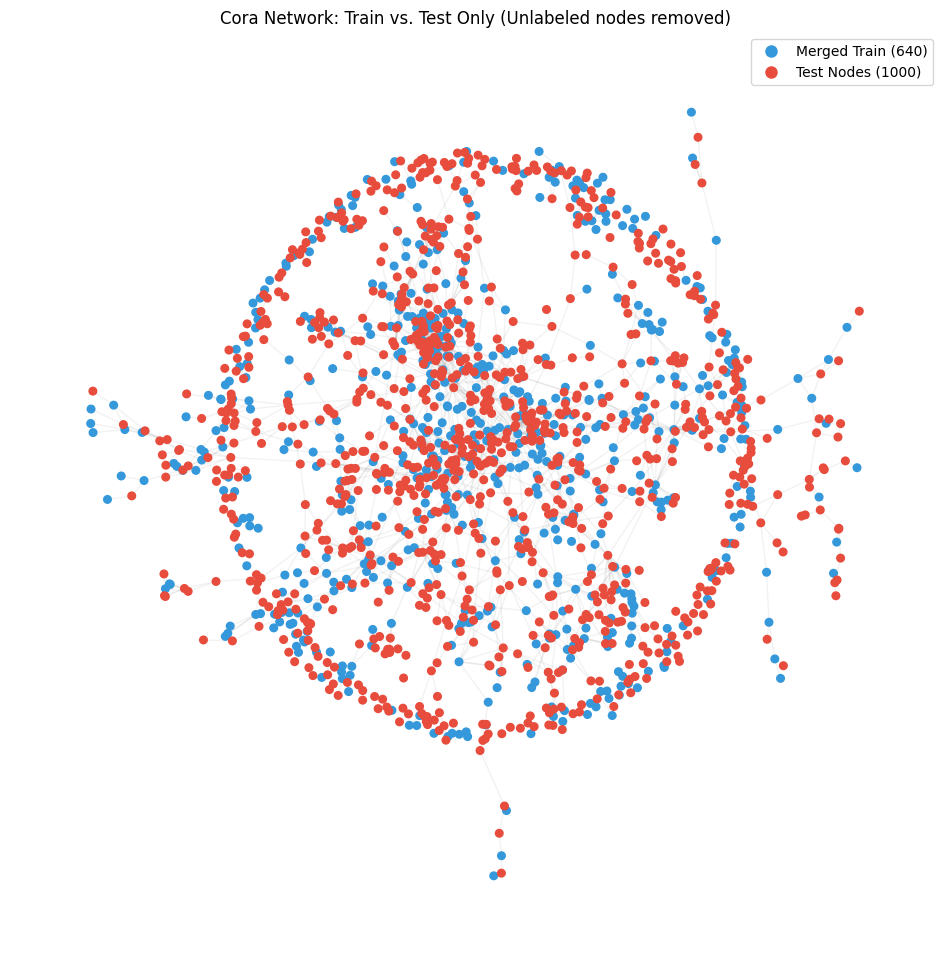
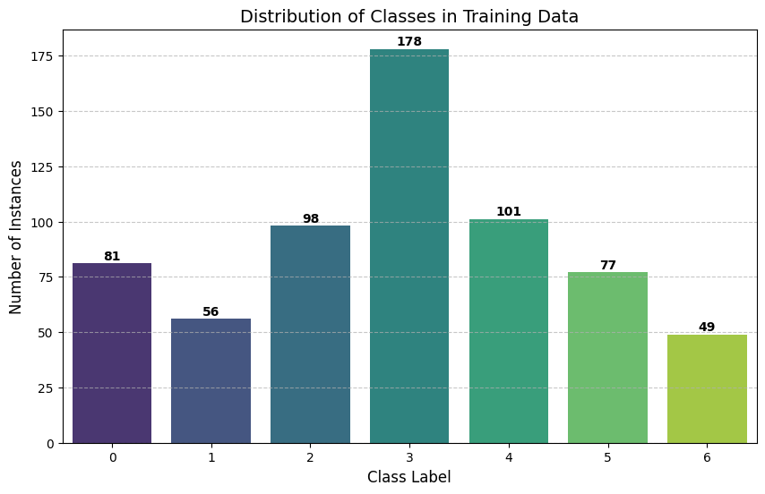
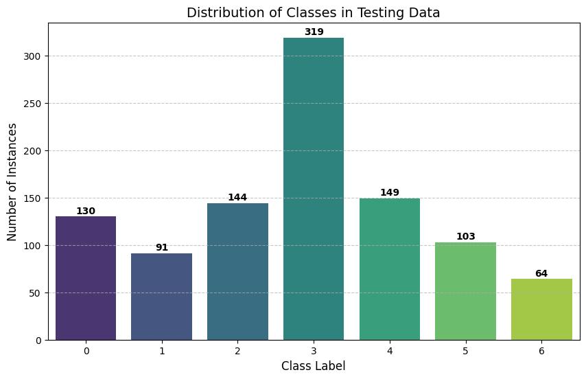

# Cora Citation Network - Node Classification

This project implements a baseline classification model for the **Cora Dataset**. The approach uses a Random Forest Classifier to predict the category of scientific papers based on their word content.

## 📊 Dataset Statistics
The dataset was processed using the `Planetoid` library with the following graph properties:

* **Undirected:** True
* **Self-loops:** False
* **Isolated Nodes:** False
* **Total Training Nodes:** 640 
* **Training Label Rate:** 0.236
* **Total Testing Nodes:** 1,000
* **Testing Label Rate:** 0.369

## 🏷️ Category Mapping
The dataset classifies papers into 7 distinct scientific fields:

| Index | Category Name       |
| :--- | :---               |
| 0    | Theory             |
| 1    | Reinforcement Learning |
| 2    | Genetic Algorithms |
| 3    | Neural Networks    |
| 4    | Probabilistic Methods |
| 5    | Case Based         |
| 6    | Rule Learning      |

---

## Class Distribution 

## Dataset Distribution

| Index | Category Name       | Training Set |            | Testing Set |            |
| :--- | :---               | :---: | :---: | :---: | :---: |
|       |                    | **Count** | **%** | **Count** | **%** |
| 0    | Theory             | 81    | 12.66% | 130   | 13.0% |
| 1    | Reinforcement Learning | 56  | 8.75%  | 91    | 9.1%  |
| 2    | Genetic Algorithms | 98    | 15.31% | 144   | 14.4% |
| 3    | Neural Networks    | 178   | 27.81% | 319   | 31.9% |
| 4    | Probabilistic Methods | 101 | 15.78% | 149   | 14.9% |
| 5    | Case Based         | 77    | 12.03% | 103   | 10.3% |
| 6    | Rule Learning      | 49    | 7.66%  | 64    | 6.4%  |
| **Total** | | **640** | **100%** | **1000** | **100%** |

## 📁 Data Structure
The processed data is exported into the following CSV files:
- **train.csv**: Features and labels for the 640 training nodes.
- **test.csv**: Features for the 1,000 test nodes (labels removed for blind testing).
- **submission.csv**: The final model output in `id, label` format.

The ground truth wasn't shared here. It will be used for evaluation.

## 🛠️ Requirements
To run this project, you need the following Python libraries:

- pandas
- numpy
- scikit-learn
- torch
- torch-geometric
- matplotlib
- networkx

## 📤 Submission Rules
- Submit exactly **one CSV file**
- File must be named: `<github_username>.csv`
- CSV must contain a column named `label`
- Number of rows must match the test set (1000 rows)

## 🤓 Have a nice works!