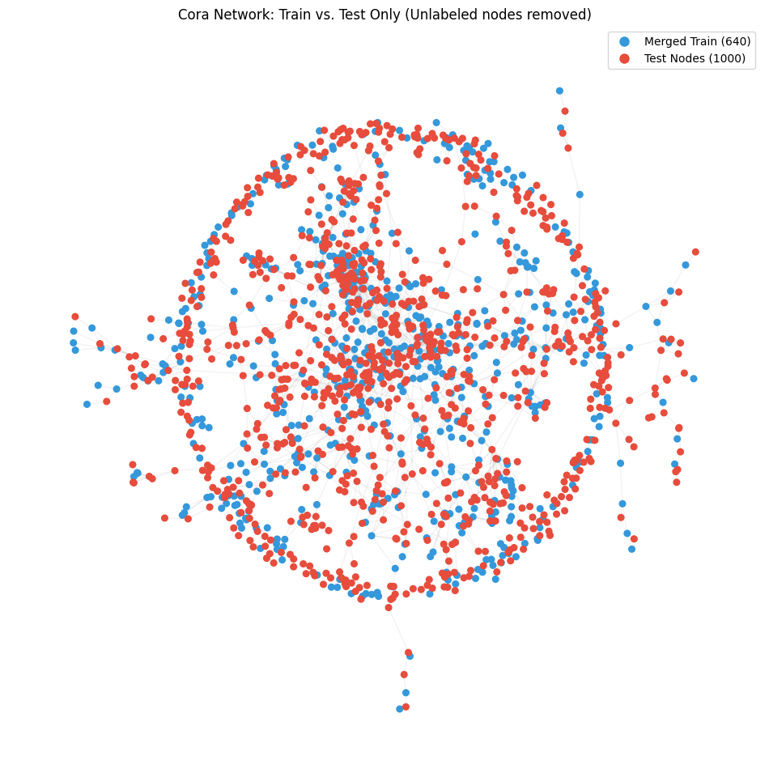
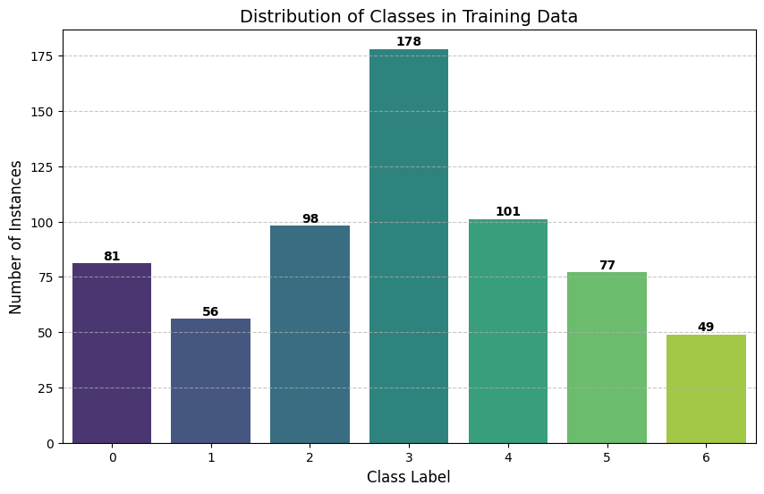
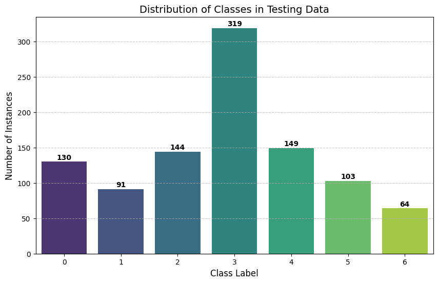

# Cora Citation Network - Node Classification

## 🎯 Challenge Overview
Investigating the Cora Network: Can you solve the mystery of the missing paper subjects?
Your score is determined by the **minimum per-class F1 score** - your worst-performing class defines your final rank!

## 📊 Dataset Information
The dataset was processed using the `Planetoid` library with the following graph properties:

* **Undirected:** True
* **Self-loops:** False
* **Isolated Nodes:** False
* **Total Training Nodes:** 640 
* **Training Label Rate:** 0.236
* **Total Testing Nodes:** 1,000
* **Testing Label Rate:** 0.369

## 🏷️ Category Mapping
The dataset classifies papers into 7 distinct scientific fields:

| Index | Category Name       |
| :--- | :---               |
| 0    | Theory             |
| 1    | Reinforcement Learning |
| 2    | Genetic Algorithms |
| 3    | Neural Networks    |
| 4    | Probabilistic Methods |
| 5    | Case Based         |
| 6    | Rule Learning      |

----

## Class Distribution 

## Dataset Distribution

| Index | Category Name       | Training Set |            | Testing Set |            |
| :--- | :---               | :---: | :---: | :---: | :---: |
|       |                    | **Count** | **%** | **Count** | **%** |
| 0    | Theory             | 81    | 12.66% | 130   | 13.0% |
| 1    | Reinforcement Learning | 56  | 8.75%  | 91    | 9.1%  |
| 2    | Genetic Algorithms | 98    | 15.31% | 144   | 14.4% |
| 3    | Neural Networks    | 178   | 27.81% | 319   | 31.9% |
| 4    | Probabilistic Methods | 101 | 15.78% | 149   | 14.9% |
| 5    | Case Based         | 77    | 12.03% | 103   | 10.3% |
| 6    | Rule Learning      | 49    | 7.66%  | 64    | 6.4%  |
| **Total** | | **640** | **100%** | **1000** | **100%** |

## 🚀 Quick Start Guide

### 1. Fork & Clone

- Click the "Fork" button at the top right of this page

- You'll be redirected to https://github.com/YOUR_USERNAME/gnn-challenge

    Clone Your Fork
- bash

- git clone https://github.com/YOUR_USERNAME/gnn-challenge.git
- cd gnn-challenge

### 2. Install Dependencies
- bash

- pip install -r starter_code/requirements.txt

### 3. Train Your Model & Generate Submission

- Modify starter_code/baseline.py or create your own model

- CRITICAL: Your output file MUST be named: github_<YOUR_USERNAME>.csv
        

### 4. 📁 Submit Your Results

Your CSV file MUST follow this exact format:
File Name:

- submissions/github_<your_github_username>.csv

Examples:

- submissions/github_emre123.csv

File Format:
- csv

| prediction | 
|----|
| 3  | 
| 3  | 
| 2  | 
| ... |

Requirements:

- Single column named prediction (exact spelling)

- No index column (no row numbers)

- Same number of rows as the test set

- Predictions must be integers (0, 1, 2, etc.)

- No header row except the column name

- CSV format (not Excel, not TSV)
- Number of rows must match the test set (1000 rows)

Commit & Push Process

- git add submissions/github_<YOUR_USERNAME>.csv
- git commit -m "Submission by <YOUR_USERNAME>"
- git push origin main

### 5. Create Pull Request

### 6. ⚡Automated Scoring
⏳ What Happens Next?

- ✅ Scoring runs automatically on your PR

- ✅ Score appears as a comment on your PR

- ✅ Minimum per-class F1 score is calculated

- ✅ Validation checks ensure correct format

After PR is merged:

- ✅ Leaderboard updates automatically

- ✅ Your ranking appears in leaderboard.md

- ✅ Score is preserved even if you submit again later

### 7.🏆 Leaderboard Rules
- Highest minimum per-class F1 score wins

- Tiebreaker: Earliest submission timestamp

- Multiple submissions allowed: Only best score kept

- View leaderboard: Check leaderboard.md after PR merge

### 8. Baseline Performance (validation set)

- Min per-class F1: ~0.5

Your goal: Beat the baseline! 🎯

## References
- Data: [Planetoid-Cora](https://pytorch-geometric.readthedocs.io/en/2.5.0/generated/torch_geometric.datasets.Planetoid.html)

😈Your worst class performance defines your score.

## 🤓 Have a nice works!